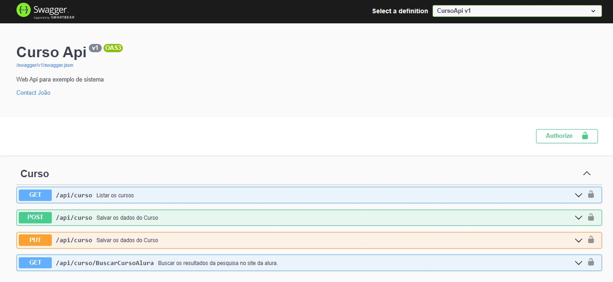
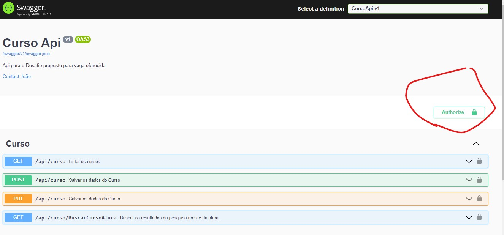
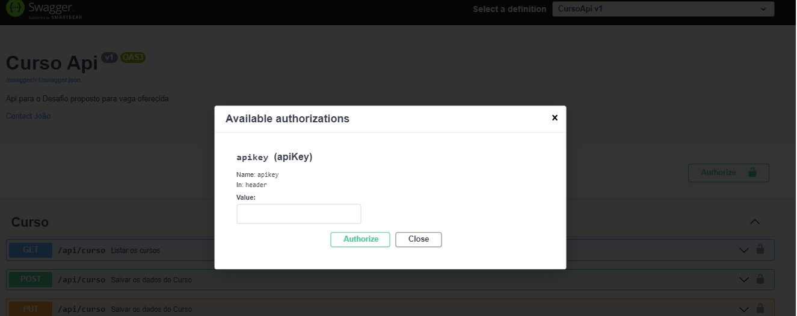
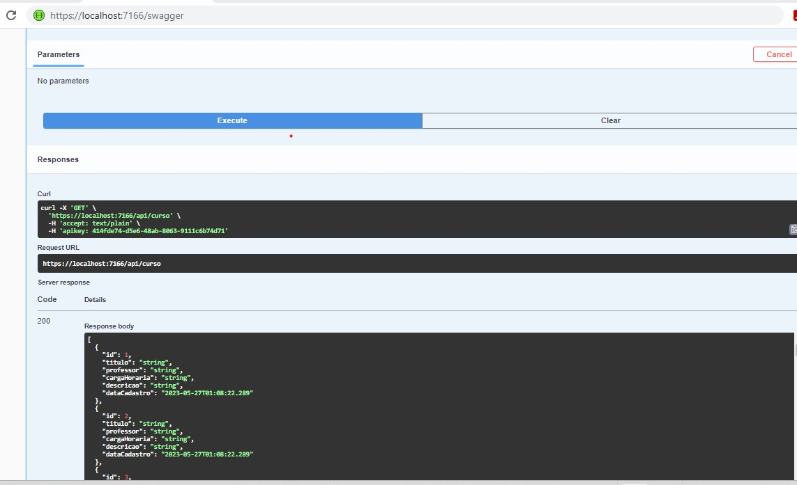
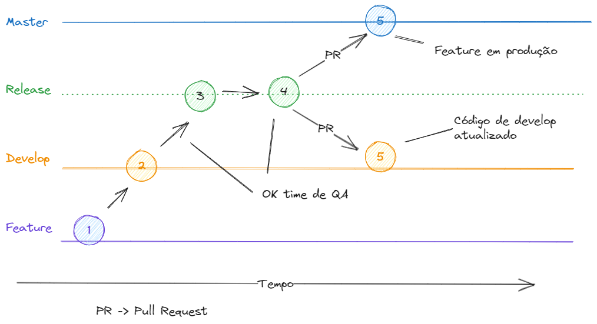

# Passos para execução do Projeto


## Configuração do Ambiente de Desenvolvimento
Antes de iniciar o desenvolvimento, é necessário configurar o ambiente de desenvolvimento. Siga as etapas abaixo para configurar o ambiente:

Instale o .NET Core 6: [Link para download](https://dotnet.microsoft.com/download/dotnet/6.0)
Instale o Git: [Link para download](https://git-scm.com/downloads)


Crie uma pasta para o projeto o exemplo irá ajudar:
```bash 
mkdir -p C:\Users\<user>\Documents\GitHub\Projeto-CSharp
cd C:\Users\<user>\Documents\GitHub\Projeto-CSharp
```
Obtenha o projeto no Github
```bash 
git clone https://github.com/joaomarcelo81/DesafioTecnicoArtycs.git
```
Compile o projeto
```bash 
dotnet build
```
Execute o projeto
```bash 
dotnet run
```
Abra o Chrome com a url  https://localhost:7166/swagger




Antes de executar qualquer endpoint é necessario inserir o APIKEY

Clique no botão


Insira a ApiKey : **414fde74-d5e6-48ab-8063-9111c6b74d71**



Swagger aberto para ser utlizado:



## Para Validar o projeto é necessário executar o metodo 

```bash
curl -X 'GET' \
  'https://localhost:7166/api/curso/BuscarCursoAlura?busca=RPA' \
  -H 'accept: */*' \
  -H 'apikey: 414fde74-d5e6-48ab-8063-9111c6b74d71'
```

Execução do método de buscar os cursos.


# Documentação do Projeto

<a name="#content"></a>

**Content**

<!-- TOC depthFrom:1 depthTo:6 withLinks:1 updateOnSave:1 orderedList:0 -->
- [Passos para execução do Projeto](#passos-para-execução-do-projeto)
  - [Configuração do Ambiente de Desenvolvimento](#configuração-do-ambiente-de-desenvolvimento)
  - [Para Validar o projeto é necessário executar o metodo](#para-validar-o-projeto-é-necessário-executar-o-metodo)
- [Documentação do Projeto](#documentação-do-projeto)
  - [Introdução](#introdução)
  - [Tecnologias utlizadas no desenvolvimento](#tecnologias-utlizadas-no-desenvolvimento)
      - [.NET Core 6](#net-core-6)
      - [Web API](#web-api)
      - [FluentValidation](#fluentvalidation)
      - [AutoMapper](#automapper)
      - [Entity Framework](#entity-framework)
    - [Arquitetura do Projeto](#arquitetura-do-projeto)
      - [Domain-Driven Design (DDD)](#domain-driven-design-ddd)
    - [Versionamento e Repositório](#versionamento-e-repositório)
      - [GitHub](#github)
      - [GitFlow](#gitflow)
    - [Documentação](#documentação)
      - [Swagger](#swagger)
    - [Testes](#testes)
      - [MOQ](#moq)
      - [XUnit](#xunit)
    - [Outras tecnologias utlizadas no projeto](#outras-tecnologias-utlizadas-no-projeto)
      - [Selenium WebDriver](#selenium-webdriver)
  - [GitHub](#github-1)
    - [Fluxo de Trabalho com o GitFlow](#fluxo-de-trabalho-com-o-gitflow)
      - [Fluxo de uma Feature](#fluxo-de-uma-feature)
      - [Fluxo de um HotFix](#fluxo-de-um-hotfix)
  - [Documentação da API com Swagger](#documentação-da-api-com-swagger)
    - [Configuração do Swagger](#configuração-do-swagger)
  - [Estrutura do Projeto](#estrutura-do-projeto)
    - [DesafioTecnicoArtycs.Api:](#desafiotecnicoartycsapi)
    - [DesafioTecnicoArtycs.Domain:](#desafiotecnicoartycsdomain)
    - [DesafioTecnicoArtycs.Infrastructure:](#desafiotecnicoartycsinfrastructure)
    - [DesafioTecnicoArtycs.Application:](#desafiotecnicoartycsapplication)
    - [DesafioTecnicoArtycs.CrossCutting.IoC:](#desafiotecnicoartycscrosscuttingioc)
    - [DesafioTecnicoArtycs.Test:](#desafiotecnicoartycstest)
  - [Desenvolvimento de Web API com .NET Core](#desenvolvimento-de-web-api-com-net-core)
    - [Código Web API](#código-web-api)
  - [Validação de Dados com FluentValidation](#validação-de-dados-com-fluentvalidation)
      - [Autenticação de API com API Key e Basic Authentication](#autenticação-de-api-com-api-key-e-basic-authentication)
      - [API Key](#api-key)
  - [Mapeamento de Objetos com AutoMapper](#mapeamento-de-objetos-com-automapper)
  - [Persistência de Dados com EntityFramework](#persistência-de-dados-com-entityframework)
  - [Testes unitários](#testes-unitários)
    - [XUnit \& MOQ](#xunit--moq)
      - [Funcionalidades e Vantagens do MOQ](#funcionalidades-e-vantagens-do-moq)
      - [Triple A](#triple-a)
      - [Exemplo de um codigo do projeto utlizando as tecnologias](#exemplo-de-um-codigo-do-projeto-utlizando-as-tecnologias)
  - [Conclusão](#conclusão)
<!-- /TOC -->


## Introdução

Este documento fornece uma visão geral do Projeto DesafioTecnicoArtycs, que é um aplicativo desenvolvido em C# utilizando os princípios do Domain-Driven Design (DDD). O projeto utiliza o GitFlow como modelo de fluxo de trabalho de controle de versão, FluentValidation para validação de dados, AutoMapper para mapeamento de objetos, EntityFramework como ORM (Object-Relational Mapping), .NET Core 6 como plataforma de desenvolvimento, Web API para construir uma API RESTful, XUnit para testes unitários seguindo o padrão Triple A (Arrange, Act, Assert), Documentação Swagger para documentar a API e Selenium WebDriver para testes de interface. Também utilizamos o MOQ para criar objetos simulados (mocks) durante os testes unitários, garantindo a correta isolação de dependências e facilitando a definição de comportamentos específicos dos objetos simulados.

<a name="tecnologias-utlizadas-no-desenvolvimento"></a>

## Tecnologias utlizadas no desenvolvimento
#### .NET Core 6
O .NET Core 6 é uma plataforma de desenvolvimento multiplataforma, de código aberto, para a criação de aplicativos modernos. Ele oferece uma ampla gama de recursos e melhorias em relação às versões anteriores do .NET Core. No DesafioTecnicoArtycs, o .NET Core 6 é a base para o desenvolvimento da aplicação.

#### Web API
A Web API é uma abordagem para construir APIs RESTful usando o protocolo HTTP. Ela permite a exposição dos recursos da aplicação de forma padronizada e de fácil consumo por parte dos clientes. No DesafioTecnicoArtycs, a Web API é utilizada para criar endpoints que permitem a comunicação com o aplicativo.

#### FluentValidation
O FluentValidation é uma biblioteca de validação de dados para aplicações .NET. Ele oferece uma maneira simples e fluente de definir regras de validação para as entidades do domínio. No DesafioTecnicoArtycs, o FluentValidation é utilizado para garantir a integridade dos dados e a consistência das regras de negócio.

#### AutoMapper
O AutoMapper é uma biblioteca que simplifica o mapeamento de objetos em aplicações .NET. Ele permite a configuração de regras de mapeamento entre classes de domínio e classes de DTO (Data Transfer Objects). No DesafioTecnicoArtycs, o AutoMapper é utilizado para facilitar a conversão de objetos entre as camadas do aplicativo.

#### Entity Framework
O Entity Framework é um framework ORM (Object-Relational Mapping) que permite o mapeamento de objetos para bancos de dados relacionais. Ele simplifica a interação com o banco de dados e oferece recursos avançados, como migrações de banco de dados e consultas LINQ. No DesafioTecnicoArtycs, o Entity Framework é utilizado para acessar e manipular os dados no banco de dados.

<a name="arquitetura-do-Projeto"></a>

### Arquitetura do Projeto
#### Domain-Driven Design (DDD)
O DesafioTecnicoArtycs foi desenvolvido seguindo os princípios do Domain-Driven Design (DDD). O DDD é uma abordagem de design de software que enfoca a modelagem do domínio da aplicação. Ele promove a separação clara entre a lógica de negócios e a implementação técnica, permitindo uma melhor compreensão e manutenção do sistema.

<a name="versionamento-repositorio"></a>

### Versionamento e Repositório

#### GitHub
GitHub é uma plataforma web baseada em Git, amplamente utilizada para hospedar e gerenciar repositórios de código-fonte. Ele oferece recursos como controle de versão, colaboração em equipe, rastreamento de problemas e integração contínua. O GitHub é popular entre desenvolvedores e projetos de código aberto, fornecendo um ambiente centralizado para compartilhar, revisar e colaborar em projetos de software.
#### GitFlow
O GitFlow é um modelo de fluxo de trabalho de controle de versão baseado no Git. Ele fornece uma estrutura clara para o gerenciamento de branches e releases do projeto. O DesafioTecnicoArtycs segue o GitFlow para garantir um desenvolvimento organizado e controlado.

<a name="documentacao-projeto"></a>

### Documentação

#### Swagger
O Swagger é uma ferramenta de documentação de API que facilita a criação, o teste e a documentação de APIs RESTful. Ele fornece uma interface interativa para explorar e testar os endpoints da API. No DesafioTecnicoArtycs, o Swagger é utilizado para documentar os endpoints da Web API e fornecer uma documentação clara e fácil de usar para os desenvolvedores e consumidores da API.

### Testes
#### MOQ
O MOQ é uma biblioteca de mocking para .NET que permite a criação de objetos simulados para facilitar a realização de testes unitários. Ele é amplamente utilizado no desenvolvimento de aplicações C# para isolar as dependências e garantir que o código seja testado de forma isolada.

#### XUnit
O XUnit é um framework de teste unitário para aplicações .NET. Ele fornece uma maneira simples e eficiente de escrever testes automatizados para verificar o comportamento do código. No DesafioTecnicoArtycs, o XUnit é utilizado para escrever testes unitários que garantem a qualidade e o funcionamento correto do sistema.

<a name="outras-tecnologias-utlizadas-projeto"></a>

### Outras tecnologias utlizadas no projeto

#### Selenium WebDriver
O Selenium WebDriver é uma ferramenta de automação de testes que permite a interação com aplicativos web. Ele simula a interação de um usuário real com o aplicativo, permitindo a execução de testes de interface automatizados. No DesafioTecnicoArtycs, o Selenium WebDriver é utilizado para realizar testes de interface que garantem a correta interação do aplicativo com o usuário.

<a name="github"></a>

## GitHub
Este documento descreve a estrutura e o fluxo de trabalho do projeto no [Github](https://github.com/joaomarcelo81/DesafioTecnicoArtycs), seguindo o padrão `GitFlow`. O `GitFlow` é um modelo de ramificação de código-fonte que oferece uma abordagem estruturada para controle de versão e colaboração em equipe. Este modelo promove uma separação clara entre o desenvolvimento de novas funcionalidades, correções de bugs e versões estáveis do software.

### Fluxo de Trabalho com o GitFlow

O fluxo de trabalho do `GitFlow` consiste em algumas etapas básicas que são executadas durante o desenvolvimento e lançamento do software. Aqui está um resumo das etapas principais:

**Desenvolvimento de Funcionalidades:** Crie um novo branch a partir do develop para desenvolver uma nova funcionalidade. Faça commits regulares e, quando a funcionalidade estiver concluída, crie um pull request para mesclar as alterações de volta para o develop. Após a revisão do código, faça a mesclagem.

**Correção de Bugs:** Caso seja necessário corrigir um bug, crie um novo branch a partir do develop ou do master, dependendo da gravidade do bug. Desenvolva a correção no branch criado e siga o mesmo processo de pull request e mesclagem descrito acima.

**Preparação para o Lançamento:** Quando estiver pronto para lançar uma nova versão estável do software, crie um branch release a partir do develop. Neste branch, faça os ajustes finais, como atualização da documentação, versionamento e preparação de pacotes. Teste a versão no branch release e, quando estiver pronto, faça a mesclagem no master e no develop.

**Hotfixes:** Caso surja um bug crítico na versão de produção, crie um branch hotfix a partir do master. Desenvolva a correção no branch criado e siga o mesmo processo de pull request e mesclagem descrito acima. Após a mesclagem, faça a atualização da versão no master e no develop.


O repositório do projeto no Github deve seguir a seguinte estrutura básica:

1. Master Branch: O branch master é o ramo principal do repositório e contém o código-fonte da versão mais recente e estável do software. Cada commit no master deve corresponder a uma versão lançada do software.

2. Develop Branch: O branch develop é o ramo de desenvolvimento principal. Ele contém as últimas alterações em desenvolvimento e serve como ponto de integração para as funcionalidades e correções de bugs em andamento.

3. Feature Branches: Para cada nova funcionalidade ou tarefa, deve-se criar um novo branch a partir do develop. O nome do branch deve seguir o padrão feature/<nome-da-funcionalidade> ou feature/<numero-da-tarefa>.

4. Hotfix Branches: Caso seja necessário corrigir bugs críticos na versão de produção, deve-se criar um novo branch a partir do master com o nome no padrão hotfix/<nome-do-bug>.

5. Release Branches: Antes de lançar uma nova versão estável do software, deve-se criar um novo branch a partir do develop para preparar a versão. O nome do branch deve seguir o padrão release/<numero-da-versao>.


#### Fluxo de uma Feature


#### Fluxo de um HotFix


<a name="documentacao-da-api-com-swagger"></a>

## Documentação da API com Swagger
O projeto utiliza o Swagger para documentar a API. O Swagger gera automaticamente uma documentação interativa da API com base nos atributos de rota e modelo dos controladores. 

Acesse a documentação da API no endpoint `/swagger` após iniciar a aplicação.


<a name="configuracao-swagger"></a>

### Configuração do Swagger
```csharp

builder.Services.AddSwaggerGen(c =>
{
    c.SwaggerDoc("v1", new()
    {
        Title = "Curso Api",
        Version = "v1",
        Contact = new OpenApiContact()
        {
            Name = "João",
            Email = "Joaomarcelo@teste.com"

        },
        Description = "Web Api para exemplo de sistema"
    });
    c.EnableAnnotations();
    c.AddSecurityDefinition("apikey", new OpenApiSecurityScheme
    {
        Name = "apikey",
        In = ParameterLocation.Header,
        Scheme = "apikey",
        Type = SecuritySchemeType.ApiKey,
    });
    c.AddSecurityRequirement(new OpenApiSecurityRequirement
    {
        {
            new OpenApiSecurityScheme
            {
                Reference = new OpenApiReference { Type = ReferenceType.SecurityScheme, Id = "apikey" }
            },
            new List<string>()
        }
    });
});
```

<a name="estrutura-do-projeto"></a>

## Estrutura do Projeto
A estrutura do projeto segue o padrão de arquitetura DDD para separação de responsabilidades e modularização do código-fonte. A estrutura do projeto é a seguinte:


<a name="desafiotecnicoartycsapi"></a>

### DesafioTecnicoArtycs.Api:

O projeto DesafioTecnicoArtycs.Api é responsável por fornecer a interface de programação de aplicativos (API) para o aplicativo. Ele é construído utilizando a plataforma .NET Core 6 e segue os princípios do Domain-Driven Design (DDD). A camada API é responsável por receber as requisições dos clientes, processar os dados, interagir com as demais camadas do projeto e retornar as respostas adequadas.

<a name="desafiotecnicoartycsdomain"></a>

### DesafioTecnicoArtycs.Domain:

O projeto DesafioTecnicoArtycs.Domain contém a lógica de negócio do aplicativo. Ele é composto por entidades, objetos de valor, agregados e interfaces de repositório. Essa camada é independente de qualquer tecnologia ou framework e representa as regras de negócio do domínio em que o aplicativo está inserido.


<a name="desafiotecnicoartycsinfrastructure"></a>

### DesafioTecnicoArtycs.Infrastructure:

O projeto DesafioTecnicoArtycs.Infrastructure é responsável por implementar as interfaces de repositório definidas no projeto de domínio. Ele utiliza o Entity Framework, um ORM (Object-Relational Mapping), para realizar a persistência dos dados no banco de dados. Além disso, essa camada também pode conter outras implementações de serviços de infraestrutura, como envio de e-mails ou integrações com sistemas externos.


<a name="desafiotecnicoartycsapplication"></a>

### DesafioTecnicoArtycs.Application:

O projeto DesafioTecnicoArtycs.Application contém a camada de aplicação do projeto. Ele faz a ponte entre a camada de API e a camada de domínio, sendo responsável por receber as requisições da camada de API, executar as ações necessárias utilizando os serviços do domínio e retornar os resultados para a camada de API. Essa camada também pode conter mappers para mapear objetos entre as diferentes camadas do projeto.


<a name="desafiotecnicoartycscrosscuttingioc"></a>

### DesafioTecnicoArtycs.CrossCutting.IoC:

O projeto DesafioTecnicoArtycs.CrossCutting.IoC é responsável por configurar a injeção de dependência no projeto. Ele utiliza um container de IoC (Inversão de Controle) para registrar as dependências e fornecer as instâncias corretas em tempo de execução. Essa camada permite a separação das dependências e facilita a manutenção e testabilidade do código.


<a name="desafiotecnicoartycstest"></a>

### DesafioTecnicoArtycs.Test:

O projeto DesafioTecnicoArtycs.Test contém os testes unitários para o projeto. Ele utiliza o framework XUnit juntamente com o MOQ para escrever e executar os testes unitários. Essa camada garante que as funcionalidades do aplicativo estejam funcionando corretamente, validando o comportamento das classes e métodos implementados nas demais camadas do projeto.

<a name="desenvolvimento"></a>

## Desenvolvimento de Web API com .NET Core

O projeto utiliza o `.NET Core 6` para desenvolvimento de uma Web API. Os controladores da API são criados no projeto DesafioTecnicoArtycs.WebApi e seguem as convenções RESTful. Exemplo de uso:

### Código Web API

```csharp{.scrollbar}
    [Authorize]
    [Route("api/curso")]
    [ApiController]
    public class CursoController : Controller
    {

        private readonly ICursoService _cursoService;
        private readonly IValidator<CursoRequest> _cursoValidator;
        public readonly IMapper _mapper;
        public CursoController(IMapper mapper, ICursoService cursoService, IValidator<CursoRequest> cursoValidator)
        {
            _cursoService = cursoService;
            _cursoValidator = cursoValidator;
            _mapper = mapper;
        }
         
        [HttpGet]
        [SwaggerOperation(Summary = "Listar os cursos", Description = "Retorna uma lista de todos os cursos disponíveis na base de dados.")]
        [SwaggerResponse((int)HttpStatusCode.OK, "Retornar lista de cursos")]
        [SwaggerResponse((int)HttpStatusCode.BadRequest , Constantes.BadRequestMessage)]
        [SwaggerResponse((int)HttpStatusCode.Unauthorized, Constantes.UnauthorizedMessage)]
        public async Task<ActionResult<IList<CursoResponse>>> BuscarCursos()
        {
            var listaCursos = await _cursoService.listaCursos();

            var cursos = _mapper.Map<List<CursoResponse>>(listaCursos);
            
            return Ok(cursos);
        }

        [HttpPost]
        [SwaggerOperation(Summary = "Salvar os dados do Curso")]
        [SwaggerResponse((int)HttpStatusCode.OK)]
        [SwaggerResponse((int)HttpStatusCode.BadRequest, Constantes.BadRequestMessage)]
        [SwaggerResponse((int)HttpStatusCode.Unauthorized, Constantes.UnauthorizedMessage)]
        public async Task<ActionResult<bool>> AdicionarCurso(CursoRequest curso)
        {
            var validationResult = _cursoValidator.Validate(curso);

            var cursoEntitie = _mapper.Map<Curso>(curso);

            if (!validationResult.IsValid)
            {
                return BadRequest(validationResult.Errors);
            }

            await _cursoService.Adicionar(cursoEntitie);
            return Ok(true);
        }

        [HttpPut]
        [SwaggerOperation(Summary = "Salvar os dados do Curso")]
        [SwaggerResponse((int)HttpStatusCode.OK)]
        [SwaggerResponse((int)HttpStatusCode.BadRequest, Constantes.BadRequestMessage)]
        [SwaggerResponse((int)HttpStatusCode.Unauthorized, Constantes.UnauthorizedMessage)]
        public async Task<ActionResult<bool>> AtualizarCurso(int Id, CursoRequest curso)
        {
            var validationResult = _cursoValidator.Validate(curso);

            var cursoEntitie = _mapper.Map<Curso>(curso);

            if (!validationResult.IsValid)
            {
                return BadRequest(validationResult.Errors);
            }
            cursoEntitie.Id = Id;
            await _cursoService.Atualizar(cursoEntitie);
            return Ok(true);
        }


        [HttpGet("BuscarCursoAlura")]
        [SwaggerOperation(Summary = "Buscar os resultados da pesquisa no site da alura.")]
        [SwaggerResponse((int)HttpStatusCode.OK)]
        [SwaggerResponse((int)HttpStatusCode.BadRequest, Constantes.BadRequestMessage)]
        [SwaggerResponse((int)HttpStatusCode.Unauthorized, Constantes.UnauthorizedMessage)]
        public async Task<ActionResult<bool>> AdicionarCurso(string nomeCurso)
        {
            await _cursoService.BuscarDadosAlura();
            return Ok(true);
        }
    }
```

<a name="validacao-dados-fluentValidation"></a>

## Validação de Dados com FluentValidation

O projeto utiliza a biblioteca FluentValidation para a validação de dados. As regras de validação são definidas em classes separadas e associadas aos modelos de domínio. A validação é executada antes da persistência dos dados. Exemplo de uso:


```csharp
    public class CursoValidator : AbstractValidator<CursoRequest>
    {
        public CursoValidator()
        {         
            RuleFor(curso => curso.Titulo).NotEmpty().WithMessage("Titulo é obrigatorio.");
            RuleFor(curso => curso.Professor).NotEmpty().WithMessage("Professor é obrigatorio.");
            RuleFor(curso => curso.CargaHoraria).NotEmpty().WithMessage("CargaHoraria é obrigatorio.");
            RuleFor(curso => curso.Descricao).NotEmpty().WithMessage("Descricao é obrigatorio.");
        }
    }
```
#### Autenticação de API com API Key e Basic Authentication

A autenticação é um aspecto crucial ao construir uma API Web. Duas formas comuns de autenticação são a autenticação por chave de API (API Key) e a autenticação básica (Basic Authentication). Este documento explica como implementar essas formas de autenticação em uma API Web desenvolvida em `C#` com `.NET Core 6.`

#### API Key
A autenticação por API Key é uma forma simples de autenticar solicitações de API usando uma chave exclusiva. Cada solicitação à API deve incluir essa chave para ser considerada autenticada. 

<a name="mapeamento-objetos"></a>

## Mapeamento de Objetos com AutoMapper

O projeto utiliza o AutoMapper para realizar o mapeamento entre objetos. A configuração do mapeamento é feita no momento da inicialização da aplicação. Exemplo de uso:

```csharp
   public class DesafioTecnicoArtycsMapper : Profile
    {
        public DesafioTecnicoArtycsMapper()
        {
            CreateMap<Curso, CursoRequest>().ReverseMap();
            CreateMap<Curso, CursoResponse>().ReverseMap();
        }
    }
```

<a name="persistencia-de-dados-com-entityframework"></a>

## Persistência de Dados com EntityFramework

O projeto utiliza o EntityFramework como ORM para a persistência de dados. A configuração da conexão com o banco de dados é feita no arquivo `appsettings.json`. Exemplo de uso:

```csharp
   public class DataContext : DbContext
    {
        protected readonly IConfiguration Configuration;
        protected readonly Settings settings;

        public DataContext(Settings _settings, IConfiguration configuration)
        {
            Configuration = configuration;
            settings = _settings;

        }

        protected override void OnConfiguring(DbContextOptionsBuilder options)
        {           
            options.UseSqlite(settings.ConnectionString);
        
            options.EnableDetailedErrors(true);
        }
        public DbSet<Curso> Cursos { get; set; }

        protected override void OnModelCreating(ModelBuilder builder)
        {
            builder
    .HasAnnotation("ProductVersion", "1.1.1");

            builder.Entity("DesafioTecnicoArtycs.Domain.Entities.Curso", b =>
            {
                b.Property<int>("Id")
                    .ValueGeneratedOnAdd();

                b.Property<DateTime>("DataCadastro")
                        .HasDefaultValue(DateTime.Now);

                b.HasKey("Id");

                b.ToTable("Cursos");
            });
            base.OnModelCreating(builder);
        }
    }
```
<a name="testes-unitarios"></a>

## Testes unitários

Os testes unitários são uma parte fundamental do *DesafioTecnicoArtycs*. Eles permitem verificar se cada componente individual do sistema está funcionando corretamente. Utilizamos o framework XUnit para escrever e executar os testes, garantindo a qualidade e a integridade do código.

<a name="xunit--moq"></a>

### XUnit & MOQ

O XUnit é um framework de teste unitário para aplicações `.NET`. Ele fornece uma maneira simples e eficiente de escrever testes automatizados para verificar o comportamento do código. No *DesafioTecnicoArtycs*, o `XUnit` é utilizado para escrever testes unitários que garantem a qualidade e o funcionamento correto do sistema.

No *DesafioTecnicoArtycs*, além do framework `XUnit`, utilizamos o `MOQ` para criar objetos simulados (mocks) e implementamos o padrão Triple A (Arrange, Act, Assert) nos testes unitários. O `MOQ` nos permite isolar as dependências e definir comportamentos específicos para os objetos simulados. O padrão Triple A nos ajuda a organizar os testes em etapas claras de configuração, execução e verificação. Essas práticas contribuem para a criação de testes unitários robustos e confiáveis no projeto.

O `MOQ`é uma biblioteca de mocking para `.NET` que permite a criação de objetos simulados para facilitar a realização de testes unitários. Ele é amplamente utilizado no desenvolvimento de aplicações C# para isolar as dependências e garantir que o código seja testado de forma isolada.

<a name="funcionalidades-e-vantagens-do-moq"></a>

#### Funcionalidades e Vantagens do MOQ

1. **Criação de Objetos Simulados:** Com o `MOQ`, é possível criar objetos simulados (mocks) que se comportam como as classes reais. Isso permite que você defina o comportamento esperado desses objetos durante os testes.

2. **Definição de Comportamentos:** O `MOQ` permite que você defina comportamentos específicos para os objetos simulados. Você pode configurar retornos de métodos, lançamento de exceções e outros comportamentos personalizados para simular diferentes cenários durante os testes.

3. **Verificação de Chamadas:** O `MOQ` também oferece recursos para verificar se determinados métodos foram chamados durante a execução do código testado. Isso é útil para garantir que o código esteja interagindo corretamente com as dependências.

4. **Fácil Integração com Estruturas de Teste:** O `MOQ` se integra perfeitamente com estruturas de teste como o `XUnit`, facilitando a criação e execução de testes unitários.

<a name="triple-a"></a>

#### Triple A

O padrão Triple A, também conhecido como AAA (Arrange, Act, Assert), é um padrão comumente utilizado para estruturar e organizar testes unitários.

**Arrange:** Nesta etapa, são realizadas as configurações e preparações necessárias para o teste. Isso inclui a criação de objetos, a definição de entradas e a configuração do ambiente necessário para executar o código a ser testado.

**Act:** Nesta etapa, é realizada a execução do código a ser testado, geralmente chamando um método ou uma função específica. O objetivo é obter o resultado ou o estado esperado com base nas configurações realizadas anteriormente.

**Assert:** Nesta etapa, são feitas as verificações para confirmar se o resultado obtido na etapa "Act" está de acordo com o esperado. São utilizadas asserções para comparar o resultado real com o resultado esperado e determinar se o teste foi bem-sucedido ou falhou.

O padrão Triple A ajuda a tornar os testes unitários mais claros, estruturados e fáceis de entender. Cada etapa tem um propósito específico, permitindo uma separação clara das responsabilidades e facilitando a identificação de problemas e erros no código testado.

<a name="exemplo-de-um-codigo-do-projeto-utlizando-as-tecnologias"></a>

#### Exemplo de um codigo do projeto utlizando as tecnologias

```csharp
[Fact]
[Trait("_cursoService", "Adicionar")]
public async Task DeveSerPossivelAdicionarCursoNoRepositorio()
{
    // Arrange
    var curso = new Curso();
    _cursoRepositoryMock.Setup(x => x.Add(curso)).ReturnsAsync(curso);

    // Act
    var result = await _cursoService.Adicionar(curso);

    // Assert
    _cursoRepositoryMock.Verify(x => x.Add(curso), Times.Once);
    Assert.Equal(curso, result);
}
```

## Conclusão

O DesafioTecnicoArtycs é um projeto C# que utiliza diversas tecnologias e padrões para criar uma aplicação robusta e escalável. Desde a utilização do Domain-Driven Design (DDD) até a implementação de testes automatizados e documentação com Swagger, todas essas tecnologias e padrões são fundamentais para o sucesso do projeto. Com essa combinação, é possível criar um aplicativo confiável, de fácil manutenção e que atenda às necessidades do cliente de forma eficiente.